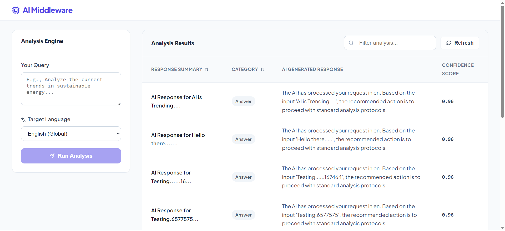

# AI Middleware Application



This project is a full-stack application featuring a React frontend and a Python (FastAPI) backend with MySQL database integration.

## Project Structure

- `frontend/`: React application (Vite, Redux Toolkit, RTK Query, Zod, React Hook Form)
- `backend/`: Python API (FastAPI, SQLAlchemy, Pydantic, SQLite)

## Prerequisites

- Node.js & npm
- Python 3.x

## Setup Instructions

### Backend Setup

1. Navigate to the `backend` directory:
   ```bash
   cd backend
   ```
2. Install dependencies:
   ```bash
   pip install -r requirements.txt
   ```
3. Initialize the database:
   - Run the seed script to create the SQLite database and add dummy data:
     ```bash
     python seed.py
     ```
   - This creates a local file `adm_app.db`. No separate DB server is required.
4. Start the backend server:
   ```bash
   python main.py
   ```
   The API will be available at `http://localhost:8000`.

### Frontend Setup

1. Navigate to the `frontend` directory:
   ```bash
   cd frontend
   ```
2. Install dependencies:
   ```bash
   npm install
   ```
3. Start the development server:
   ```bash
   npm run dev
   ```
   The UI will be available at `http://localhost:5173`.

## Features

- **Prompt Submission**: Form with Zod validation.
- **Dynamic Responses**: Handles Success, `NEEDS_CLARIFICATION`, and Error states.
- **State Management**: Efficient API calls and caching using RTK Query.
- **Insights Dashboard**: Search (debounced), sort, and pagination of AI results.
- **Architecture**: Clean separation between API logic, UI components, and state management.
